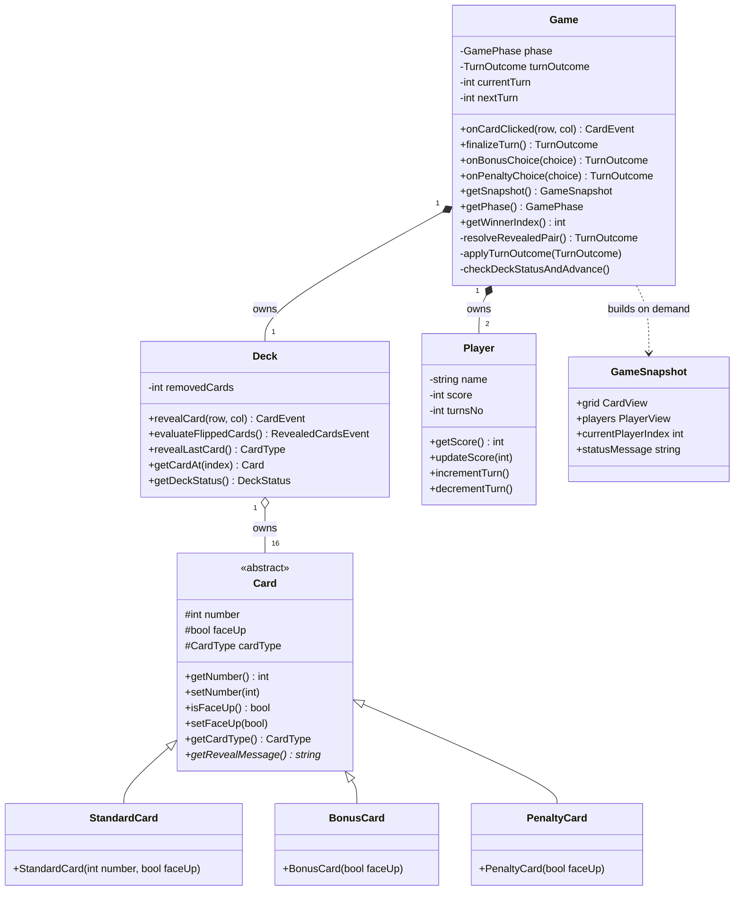
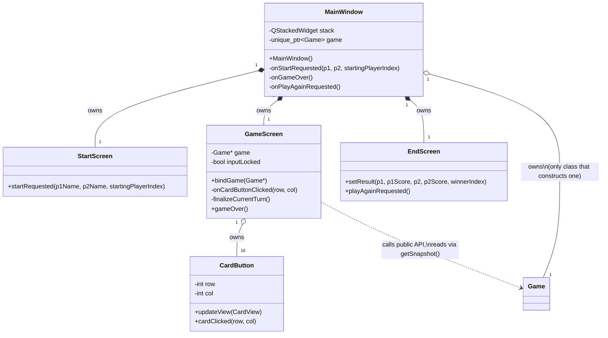
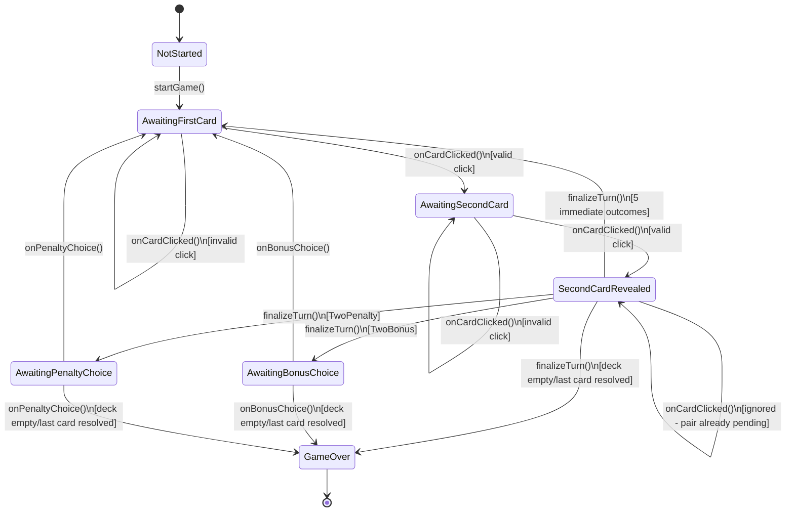
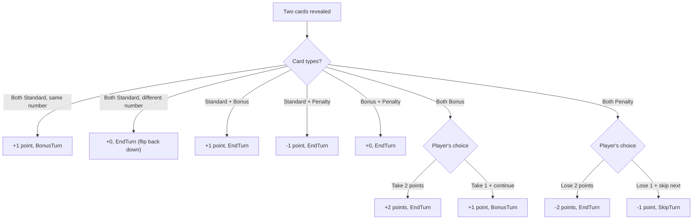
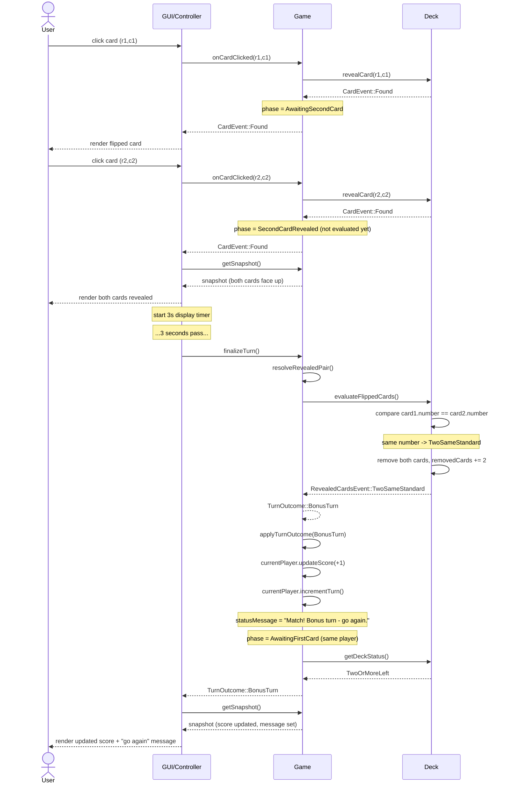
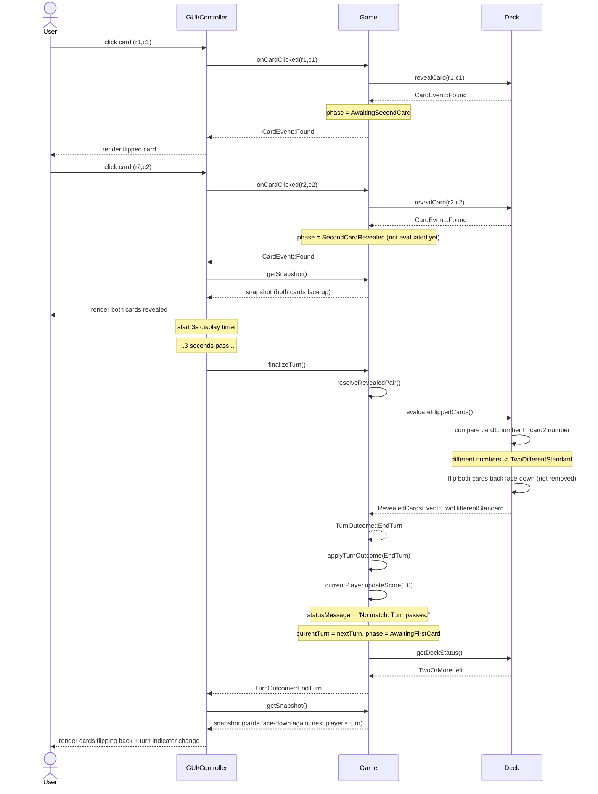
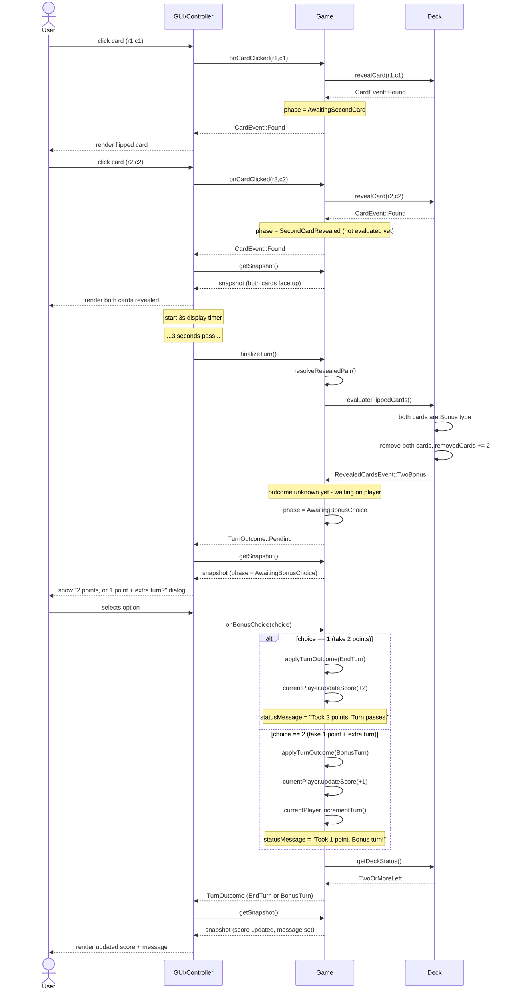
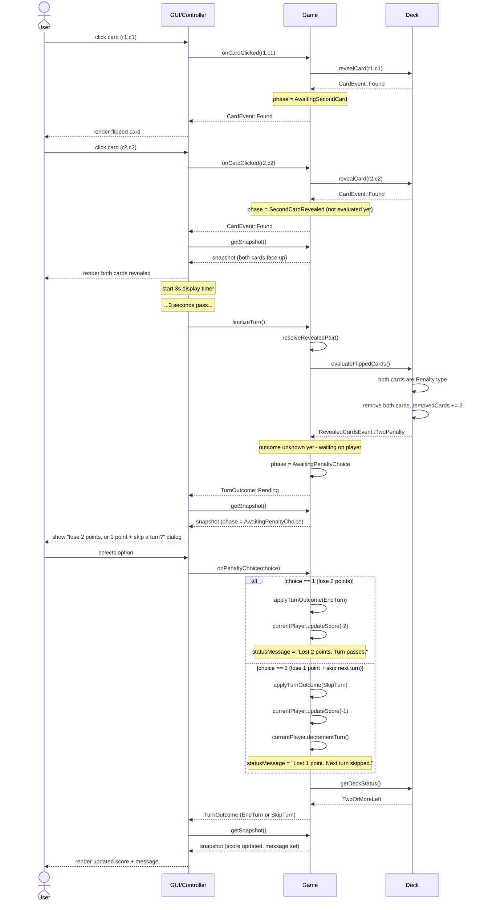

# Architecture & Design Documentation

This document is the technical companion to the [main README](../README.md).
It covers *why* the project is structured the way it is, not just *what*
each class does - the reasoning behind these decisions is as much the
point of this project as the code itself.

## Table of contents

- [Why this project was rearchitected](#why-this-project-was-rearchitected)
- [High-level architecture](#high-level-architecture)
- [Class diagram](#class-diagram)
- [GUI implementation](#gui-implementation)
- [The `Game` state machine](#the-game-state-machine)
- [Turn-resolution logic](#turn-resolution-logic)
- [Sequence diagrams](#sequence-diagrams)
- [Testing strategy](#testing-strategy)
- [Game rules reference](#game-rules-reference)

## Why this project was rearchitected

The [original version](https://github.com/ahmed-marie/INCS101-Project)
of this project had two structural weaknesses that this rewrite
specifically targets:

1. **No GUI, and no easy path to add one.** Game logic and console
   I/O (`cin`/`cout`) were interleaved directly inside the same
   methods, and the game loop *blocked* waiting for console input.
   Neither a GUI event loop nor a test can work against code shaped
   like that.
2. **Manual, unautomated tests.** The original `test.cpp` was a
   print-and-eyeball harness - useful for learning ISTQB testing
   concepts, but not something that could run in CI or give a clear
   pass/fail signal.

Both problems share one root cause, and one fix: **separate game
logic from I/O entirely**, and make that logic *event-driven* (it
reacts to one discrete input at a time and returns immediately)
rather than loop-driven (it blocks and pulls input itself). That one
change is what unlocks both a GUI and a real automated test suite.

## High-level architecture

The project follows a Model/View split, structured as three
independent build targets:

```
core/    Pure game logic. Zero I/O, zero GUI framework code.
         Depends on nothing but the C++ standard library.
gui/     Qt widgets. Reads core/ state, translates user input into
         calls on core/'s public API. Depends on core/.
tests/   GoogleTest suite. Depends on core/ only - it never touches
         gui/, since core/ is fully driveable without a UI.
```

This maps onto MVC/MVVM-style thinking as follows:

- **Model** - `Game`, `Deck`, `Player`, and the `Card` hierarchy
  (`core/`). Owns all game state and rules; has no knowledge that a
  GUI or a test even exists.
- **View** - the Qt widgets (`gui/`), which render whatever
  `Game::getSnapshot()` returns.
- **Controller** - the click-handler code living alongside those
  same Qt widgets, translating a user action (e.g. a card click)
  into a call on `Game`'s public API. In most GUI frameworks,
  including Qt, View and Controller code end up living in the same
  class - that's normal, not a design flaw; the Model/View boundary
  is the one that matters and the one this architecture strictly
  enforces.
- **`GameSnapshot`** - not one of the three MVC roles, but a
  supporting piece: a plain, disposable data-transfer object built
  fresh on every call to `getSnapshot()`. It's the *only* channel
  through which `core/` state reaches a renderer or a test.

## Class diagram



## GUI implementation

`gui/` is Qt Widgets, structured as one screen per class, plus one
class that owns the `Game` for the whole session:



`MainWindow` is the only class in the whole GUI that ever constructs
a `Game` - every other screen either receives plain data (`StartScreen`
emits a signal with the names/starting player and never touches
`Game` itself) or holds a non-owning pointer into the one `MainWindow`
owns (`GameScreen::bindGame(Game*)`). This keeps the "one owner, many
readers" rule from the core architecture intact across the UI layer
too.

**The 3-second reveal delay is a GUI-only concern, deliberately.**
When the second card of a turn is flipped, `Game` stops at a
`SecondCardRevealed` phase rather than evaluating immediately (see
[state machine](#the-game-state-machine) below) - it has no concept
of time or waiting, only phases. `GameScreen` is the one place that
turns that phase into an actual pause, via
`QTimer::singleShot(3000, this, &GameScreen::finalizeCurrentTurn)`,
so the player has a chance to see the second card before `Game`
evaluates the pair. This is a concrete case of the Model/View split
paying off: the timing requirement was purely a UI/UX need, and
implementing it never touched `core/` at all - only `Game`'s *phase
model* needed a new state, not any GUI-specific code.

While that timer is running, `GameScreen` also sets a private
`inputLocked` flag to ignore further clicks - `Game::onCardClicked()`
independently rejects any click outside `AwaitingFirstCard`/
`AwaitingSecondCard` too, so a click slipping past the GUI's lock
(or a future front-end that doesn't implement one) still can't
corrupt `Deck`'s in-progress pair-tracking.

## The `Game` state machine

`Game` tracks exactly what input it's waiting for next via
`GamePhase` - this is what lets a GUI know, at any moment, whether
to accept a card click, wait out a display delay, or show a
bonus/penalty choice dialog.



An invalid click (an out-of-range coordinate, or a card that's
already face-up) **never changes `phase`** - only a valid flip
progresses the state machine. This is deliberate: it means the same
click handler can safely be called with bad input without any
special-case handling on the caller's side.

**`SecondCardRevealed` is a deliberate pause, not an accident.**
`onCardClicked()` stops here the moment the second card of a turn is
flipped, *before* evaluating it - `resolveRevealedPair()` (still
private) only ever runs from inside the new public `finalizeTurn()`,
which is only valid while `phase == SecondCardRevealed`. This exists
specifically so a caller can render both revealed cards before the
game decides what they mean; without it, a mismatched pair could be
evaluated and flipped back down before the player ever saw the
second card. Any click received while already in
`SecondCardRevealed` is rejected outright (`CardEvent::NotFound`,
`phase` unchanged) rather than accepted and queued - a pair is
already pending evaluation, and `Game` only ever tracks one at a time.

## Turn-resolution logic

Once `finalizeTurn()` is called (see [state machine](#the-game-state-machine)
above - only valid from `SecondCardRevealed`), `resolveRevealedPair()`
maps the resulting `RevealedCardsEvent` to a score change and a
`TurnOutcome`. Five of the seven outcomes resolve immediately; the two
same-type cases (`TwoBonus`, `TwoPenalty`) pause and wait for the
player's choice via `onBonusChoice()`/`onPenaltyChoice()`.



## Sequence diagrams

Each diagram traces one full scenario, from the first click through
the score update - including the 3-second display pause before the
second card is evaluated. Source files live in
[`docs/diagrams/`](diagrams/).

### Two identical Standard cards



### Two different Standard cards



### Two Bonus cards



### Two Penalty cards



## Testing strategy

The test suite (`tests/`) mirrors `core/`'s module structure, one
file per class:

- `CardTests.cpp`, `PlayerTests.cpp`, `DeckTests.cpp` - unit tests,
  each class exercised in isolation.
- `GameTests.cpp` - integration tests: `Game` orchestrates `Deck`
  and `Player` together, so tests here exercise that orchestration
  through `Game`'s public API only (`onCardClicked`,
  `onBonusChoice`/`onPenaltyChoice`, `getSnapshot`) - private
  helper methods are exercised indirectly, never accessed directly.
- `Deck` and `Game` both expose a constructor that accepts a
  pre-built, non-shuffled state (`Deck(std::array<...>)`,
  `Game(Deck)`), specifically so tests can set up an exact scenario
  (e.g. "two Bonus cards at known positions") deterministically,
  without depending on `shuffle()`'s randomness.

*(This section will be expanded with actual coverage details once
the GoogleTest suite lands.)*

## Game rules reference

**Setup:** 16 cards in a 4x4 grid - 6 matching pairs of Standard
cards (numbered 1-6), one pair of Bonus cards, one pair of Penalty
cards. All cards start face-down.

**A turn:** the current player flips two cards. What happens next
depends on what's revealed - see the [turn-resolution flowchart](#turn-resolution-logic)
above for the complete rule set.

**End of game:** play continues until the grid is empty. Highest
score wins; equal scores end in a draw.